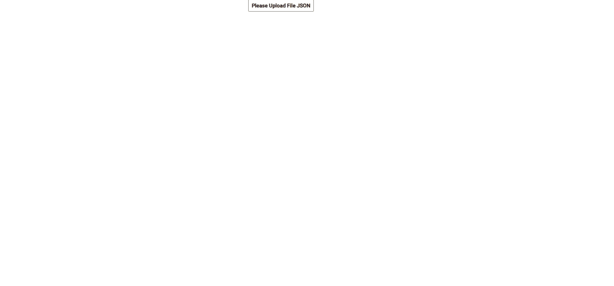

# ChartAngular

This project was generated with [Angular CLI](https://github.com/angular/angular-cli) version 11.2.13.

## Development server

Run `ng serve` for a dev server. Navigate to `http://localhost:4200/`. The app will automatically reload if you change any of the source files.

##About project
The goal of the project is to understand and improve the skills of using graphs. Charts can be built using external JSON files.

##example JSON
[{"ltvLift": [],"prevOrders":"1"},{    "ltvLift":[],"prevOrders":"2"}]

##GIF
